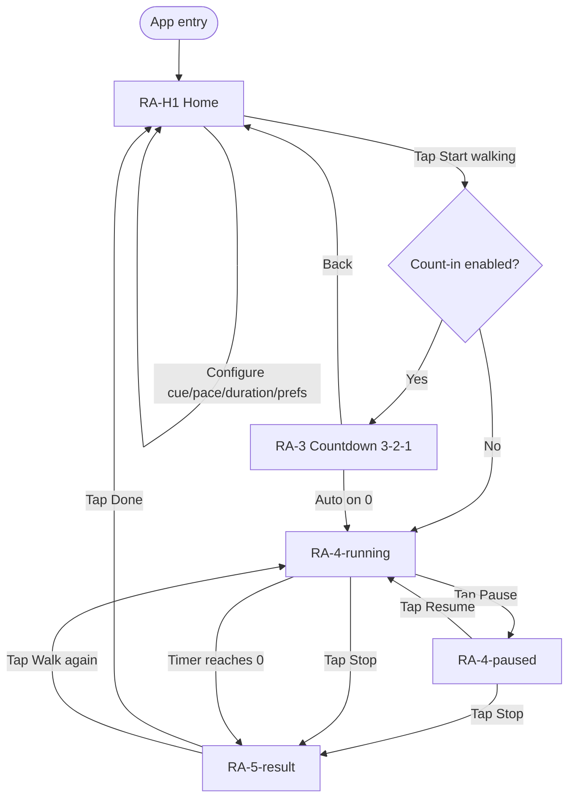
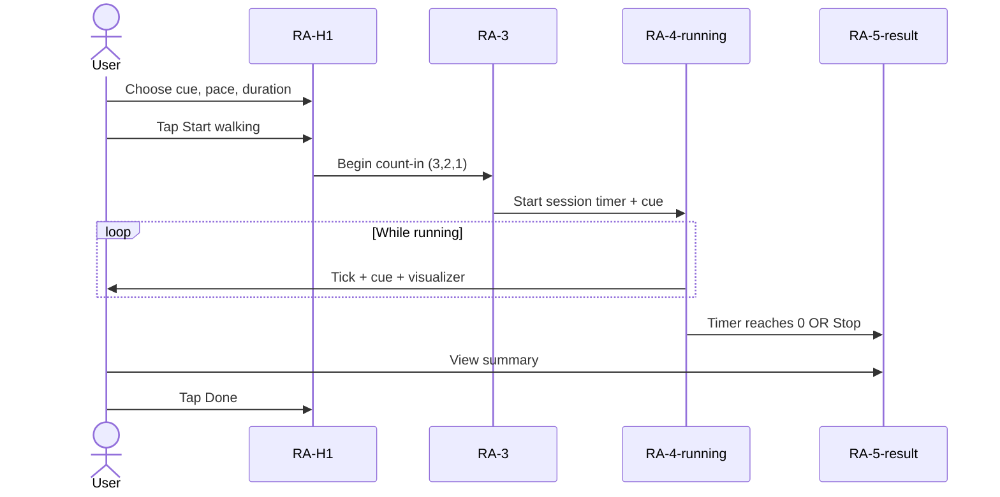
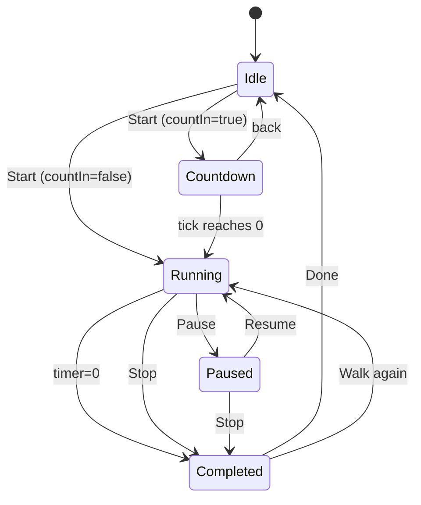

# Rhythmic Gait Assistant — Implementation Planning Document

> Audience: Claude Code developers, React Native engineers, QA, and product
> Source: 6 UI screenshots (RA-H1-A, RA-H1-B, RA-3, RA-4-running, RA-4-paused, RA-5-result) 
> you can reach to UI screenshots in .claude/UI_Screens/
> Scope: Analysis, design extraction, architecture, decomposition, tickets, roadmap
> Out of scope: Application code, screen implementations

---

## 1. Feature Overview

### Purpose
The **Rhythmic Gait Assistant** is a guided walking-rhythm feature that helps users walk in time with a configurable cue (audio, vibration, or combined) at a chosen pace (BPM) for a fixed duration. Pace selection is biased toward therapeutic, mood-based labels (Gentle / Steady / Energizing) rather than clinical metrics, which suggests use cases spanning wellness walking, mindful exercise, and rhythmic auditory stimulation (commonly used in gait training contexts).

### User goal
Start a short, structured walking session in which a rhythmic cue paces the user's steps from start to finish, and review a brief summary afterward.

### Main workflow
1. User opens the feature → home screen presents cue, pace, duration, preferences.
2. User configures the session and taps **Start walking**.
3. A 3-second count-in plays (if enabled).
4. The session runs for the chosen duration with cue + visualizer + countdown.
5. User can pause / resume / stop, or let the timer complete naturally.
6. A result summary appears; user can finish or start another walk.

### Success criteria
- User can configure and start a session in ≤ 3 taps from the home screen.
- Timer accuracy: drift ≤ ±200ms over a 15-minute session.
- Cue (audio/vibration) stays in sync with displayed BPM.
- Pause/resume preserves remaining time exactly; stop produces a valid summary.
- App remains responsive (60fps UI thread) during the active session.
- Session can be backgrounded and resumed correctly (see §14 — open question).

---

## 2. Complete User Flow

### Step-by-step navigation

| # | From | Action | To | Notes |
|---|------|--------|----|----|
| 1 | App entry | Open feature | RA-H1 (Home) | Default selections shown (Audio, Steady, 5 min, both preferences on). |
| 2 | RA-H1 | Tap a cue card | RA-H1 | Local state update; visual selection changes. |
| 3 | RA-H1 | Tap a pace card | RA-H1 | Local state update. |
| 4 | RA-H1 | Tap a duration pill | RA-H1 | Local state update. |
| 5 | RA-H1 | Toggle a preference | RA-H1 | Local state update. |
| 6 | RA-H1 | Tap **Start walking** | RA-3 (if count-in ON) or RA-4-running (if OFF) | See §14 — open question. |
| 7 | RA-3 | Countdown 3→2→1 elapses | RA-4-running | Auto-transition, no user action. |
| 8 | RA-3 | Tap back | RA-H1 | Cancels count-in. |
| 9 | RA-4-running | Tap **Pause** | RA-4-paused | Timer halts; cue silences. |
| 10 | RA-4-paused | Tap **Resume** | RA-4-running | Timer resumes from remaining. |
| 11 | RA-4-running / paused | Tap **Stop** | RA-5-result | Session ends early; summary uses elapsed time. |
| 12 | RA-4-running | Timer reaches 00:00 | RA-5-result | End chime plays (if enabled). |
| 13 | RA-5-result | Tap **Done** | RA-H1 | Returns to home with prior configuration retained. |
| 14 | RA-5-result | Tap **Walk again** | RA-4-running | Restarts a session with the same configuration; count-in is skipped on repeat (see §14 — open question). |

### Edge cases
- User taps back during count-in → cancel and return to home.
- User backgrounds the app during count-in → countdown should restart or cancel (assumption: restart on return).
- User backgrounds the app during a running session → see §14 open question on background behavior.
- Headphones disconnect mid-session → audio cue should pause; UI may show notice (not specified by screens).
- Vibration permission unavailable (web/iOS-restricted) → cue should silently fall back to Audio (not specified by screens).
- Session ends with elapsed time < some threshold → summary still shown (no minimum implied by screens).

### Mermaid — User flow



### Mermaid — Sequence (typical happy path)



---

## 3. Screen Inventory

### 3.1 RA-H1 — Home (states A and B)
**Purpose**: Allow user to configure and launch a walking session.
**Note**: RA-H1-A and RA-H1-B are scroll states of the same screen. A shows the top (hero + cue + first pace cards); B shows the bottom (remaining pace cards + duration + preferences + primary CTA).

**Visible elements**
- Header bar: back chevron (left), title "Rhythmic Gait Assistant" (center).
- Hero banner card (blue background) with decorative circle, white headline "Find your walking rhythm", and white subtitle "Real music matched to your pace guides every step."
- Card "Choose your cue" containing 3 options in a horizontal row: **Audio**, **Vibration**, **Combined**. Each option has icon, title, and short description. The selected option (Audio in mock) has a blue border and tinted background.
- Card "Pick a pace" containing 3 vertical rows:
  - **Gentle** — 72 BPM, leaf emoji/icon, description "Soft, slow — perfect for easy starts o…", right-aligned secondary text "Calm pentatonic melody at 72 BPM".
  - **Steady** — 96 BPM, blue heart emoji/icon, description "A comfortable everyday walking rhyt…", right-aligned secondary text "Warm major-scale rhythm at 96 BPM". Selected (blue border, light-blue fill).
  - **Energizing** — 120 BPM, fire emoji/icon, description "Upbeat and brisk — for when you feel…", right-aligned secondary text "Uplifting ascending beat at 120 BPM".
- Card "Duration" containing 3 pill-shaped options: **5 min** (selected), **10 min**, **15 min**.
- Card "Preferences" containing 2 rows with title + description + toggle:
  - "3-second count-in" — "A short calm countdown before music begins." Toggle ON (red).
  - "End chime" — "A gentle sound when the session finishes." Toggle ON (red).
- Primary button "Start walking" — red, full-width, rounded corners.

**User interactions**
- Tap back → exits the feature.
- Tap any cue card → updates selected cue.
- Tap any pace row → updates selected pace.
- Tap any duration pill → updates selected duration.
- Toggle preference switches → updates preference flags.
- Tap "Start walking" → proceeds to count-in or running screen.

**Navigation rules**
- Back exits.
- "Start walking" requires no validation (all fields have defaults).
- Selections persist for the duration of the screen lifecycle (see §9 for cross-screen retention).

---

### 3.2 RA-3 — Countdown
**Purpose**: Provide a 3-second "Get ready" countdown before the active session.

**Visible elements**
- Header bar (same as home).
- Centered label "Get ready…" (secondary gray text).
- Centered circular badge with rose/pink border and pale-pink fill, containing a large rose-colored digit (3, 2, or 1).
- Centered subtitle "Starting Steady rhythm…" reflecting the chosen pace (text is dynamic).
- No buttons besides the back chevron.

**Timer behavior**
- Counts down 3 → 2 → 1 at 1-second intervals.
- After "1" displays for 1s, auto-transitions to RA-4-running.

**User interactions**
- Tap back → cancel and return to home (assumption).

**Navigation rules**
- Implicit auto-navigation when countdown reaches 0.
- Only shown when "3-second count-in" preference is ON.

---

### 3.3 RA-4-running — Active session
**Purpose**: Run the walking session, display remaining time, play the cue, and visualize rhythm.

**Visible elements**
- Header bar.
- Session card containing:
  - Small uppercase label "WALKING SESSION".
  - Pace title row: blue heart icon + "Steady rhythm" (dynamic based on selected pace).
  - Status badge top-right: **Active** with blue play triangle icon, light-blue pill background, blue text.
  - Circular progress ring (gray track, blue progress indicator) with elapsed/remaining indicator.
  - Center of ring: large "MM:SS" remaining time and small "remaining" label.
  - Pill chip below ring: music-note icon + "Audio" + " · 96 BPM" (cue + BPM dynamic).
  - Audio visualizer panel: light blue background, 11 vertical bars of varying heights in shades of blue (light to mid-blue). Bars animate to suggest live audio level.
  - Caption: "Follow each cue with a comfortable, steady step."
- Two action buttons at the bottom:
  - **Pause** — outlined (white background, gray border), pause-icon + label.
  - **Stop** — filled red, stop-square-icon + label.
- Bottom progress bar (thin) — blue portion left, gray rest (mirrors ring progress).

**Timer behavior**
- Counts DOWN from chosen duration (e.g., 05:00) to 00:00.
- Updates at minimum 1-second granularity; ring/progress bar can update more smoothly (assumption: 100ms tick for visuals).
- Cue (audio or haptic pulse) emits at chosen BPM.

**User interactions**
- Tap **Pause** → transition to RA-4-paused, halt timer + cue.
- Tap **Stop** → end session, navigate to RA-5-result with the elapsed/aggregated data.
- Tap back → ambiguous (assumption: confirm-stop dialog OR treat as Stop; see §14 open question).

---

### 3.4 RA-4-paused — Paused session
**Purpose**: Indicate the session is paused; let user resume or stop.

**Visible elements**
- Header bar.
- Session card (same structure as running) with key differences:
  - Status badge top-right: **Paused** with pause-icon, amber/yellow pill background, amber/brown text.
  - Ring progress is frozen at the moment of pause.
  - Visualizer bars are flat/lighter and uniform (no animation) — visually de-emphasized.
  - Caption changes to "Session paused. Tap Resume when ready."
- Two action buttons:
  - **Resume** — outlined white, red play-triangle icon, dark label.
  - **Stop** — filled red.
- Bottom progress bar.

**Timer behavior**
- Timer is halted. Remaining time displayed (e.g., 04:41) is preserved from the moment of pause.

**User interactions**
- Tap **Resume** → return to RA-4-running.
- Tap **Stop** → end session, navigate to RA-5-result.

---

### 3.5 RA-5-result — Session summary
**Purpose**: Confirm session completion and show key statistics.

**Visible elements**
- Header bar.
- Top "hero" result card:
  - Round mint-green badge with party/confetti emoji.
  - Title "Session complete!" (bold, dark).
  - Subtitle "Great walk. Your rhythm is getting stronger."
- Stats card with 4 rows (label left, value right), separated by faint dividers:
  - **Pace** → "💙 Steady" (icon + label).
  - **Cue used** → "Audio".
  - **Duration** → "5 min".
  - **BPM** → "96 steps/min".
- Two action buttons:
  - **Done** — outlined white.
  - **Walk again** — filled red.

**User interactions**
- Tap **Done** → navigate to RA-H1.
- Tap **Walk again** → restart a session with the same configuration.

**Navigation rules**
- Back chevron behavior is unspecified by screens (assumption: treat as Done).

---

## 4. UI Component Inventory

All components below are derived strictly from what is visible. For each, "inputs" refers to props/data that drive the component; "outputs" refers to events emitted on user interaction.

### 4.1 ScreenHeader
- **Responsibility**: Display back chevron and screen title.
- **Inputs**: `title`, `onBack`.
- **Outputs**: `onBack` event.
- **States**: default.
- **Reusability**: All 5 screens use it.

### 4.2 HeroBanner
- **Responsibility**: Display the blue marketing-style hero card on home.
- **Inputs**: `title`, `subtitle`.
- **States**: default.
- **Reusability**: Used once (home), but design-system worthy.

### 4.3 SectionCard
- **Responsibility**: Generic white rounded card with optional section title and a slot for content.
- **Inputs**: `title?`, `children`.
- **States**: default.
- **Reusability**: Used by cue card, pace card, duration card, preferences card, session card, result hero, stats card.

### 4.4 OptionTile (horizontal grid item)
- **Responsibility**: A selectable square tile with icon, title, and short description.
- **Inputs**: `icon`, `title`, `description`, `selected`.
- **Outputs**: `onSelect`.
- **States**: default, selected (blue border + tinted bg), pressed.
- **Reusability**: Cue cards (Audio, Vibration, Combined).

### 4.5 ListOption (horizontal list row)
- **Responsibility**: A selectable list row with leading icon/emoji, title, sub-info, description, and right-aligned secondary text.
- **Inputs**: `icon/emoji`, `title`, `meta` (e.g., "72 BPM"), `description`, `rightText`, `selected`.
- **Outputs**: `onSelect`.
- **States**: default, selected (blue border + tinted bg), pressed.
- **Reusability**: Pace rows (Gentle, Steady, Energizing).

### 4.6 PillToggleGroup
- **Responsibility**: Single-select group of pill-shaped buttons.
- **Inputs**: `options` (array of `{value,label}`), `value`, `onChange`.
- **States**: default per pill, selected pill (blue border, blue text), pressed.
- **Reusability**: Duration selector; reusable for any single-select compact set.

### 4.7 ToggleRow
- **Responsibility**: A row with title, description, and a switch on the right.
- **Inputs**: `title`, `description`, `value`, `onChange`.
- **States**: on (red track), off (gray track), pressed.
- **Reusability**: Preferences rows; reusable for any boolean setting.

### 4.8 PrimaryButton
- **Responsibility**: Filled red CTA button.
- **Inputs**: `label`, `onPress`, `icon?`, `disabled?`.
- **States**: default, pressed, disabled, loading (assumed for future).
- **Reusability**: Start walking, Stop, Walk again.

### 4.9 SecondaryButton
- **Responsibility**: Outlined white button.
- **Inputs**: `label`, `onPress`, `icon?`, `disabled?`.
- **States**: default, pressed, disabled.
- **Reusability**: Pause, Resume, Done.

### 4.10 CountdownBadge
- **Responsibility**: Circular pink-bordered, pale-fill badge displaying a large digit.
- **Inputs**: `value` (string or number).
- **States**: animates on each tick (assumed scale/fade).
- **Reusability**: RA-3 only, but ring/animation primitives reusable.

### 4.11 CircularProgressTimer
- **Responsibility**: Circular progress ring with center MM:SS time and "remaining" caption.
- **Inputs**: `progress` (0–1), `remainingSeconds`, `running` (bool — affects animation).
- **States**: running, paused.
- **Reusability**: Running + paused screens.

### 4.12 StatusBadge
- **Responsibility**: Small pill badge with icon and label.
- **Inputs**: `variant` (`active` | `paused` | `complete` | …), `label`, `icon`.
- **States**: per variant (color-coded).
- **Reusability**: Running / paused / extendable for future statuses.

### 4.13 CueChip
- **Responsibility**: Read-only chip showing current cue type and BPM.
- **Inputs**: `cue` ("Audio" | "Vibration" | "Combined"), `bpm`.
- **States**: default.
- **Reusability**: Running, paused screens.

### 4.14 AudioVisualizer
- **Responsibility**: Decorative animated bar chart reflecting audio rhythm.
- **Inputs**: `active` (bool), optional `intensity` array (assumption).
- **States**: active (animated, varied heights/colors), idle (flat, uniform light bars).
- **Reusability**: Running + paused screens.

### 4.15 ProgressBar
- **Responsibility**: Thin horizontal progress bar (blue fill on gray track).
- **Inputs**: `progress` (0–1).
- **States**: default.
- **Reusability**: Bottom of running/paused screens; can mirror ring.

### 4.16 ResultHeroCard
- **Responsibility**: Celebratory header with mint badge + emoji + title + subtitle.
- **Inputs**: `title`, `subtitle`, `iconAsset`.
- **Reusability**: Result screen; can be reused for any "session complete" surface.

### 4.17 StatRow
- **Responsibility**: Label/value row inside the result stats card.
- **Inputs**: `label`, `value`, `valueIcon?`.
- **States**: default.
- **Reusability**: Result screen; reusable for any key/value summary.

### 4.18 Modal/Dialog candidates (not in screens, but worth flagging)
- Stop-confirmation dialog (if Stop should confirm).
- Permissions request modal (audio playback, vibration, etc.).

---

## 5. Design System Extraction

> Hex values marked **(estimated)** were sampled visually from the screenshots and may need to be verified against the Figma source.

### 5.1 Colors

| Token | Hex (estimated) | RGB | Usage |
|---|---|---|---|
| Brand / Primary action | `#B5183C` | 181, 24, 60 | Primary CTAs (Start walking, Stop, Walk again) |
| Brand / Primary pressed | `#9A0F32` | 154, 15, 50 | Pressed/active state of primary button (estimated) |
| Accent / Information | `#2563EB` | 37, 99, 235 | Hero banner, selected states, "Active" badge, ring progress |
| Accent / Tint surface | `#EFF4FF` | 239, 244, 255 | Selected card background fill |
| Accent / Tint border | `#BFD3FF` | 191, 211, 255 | Selected card border (estimated) |
| Countdown / Rose accent | `#D88B8B` | 216, 139, 139 | Countdown digit color and ring (estimated) |
| Countdown / Rose surface | `#FCE9E9` | 252, 233, 233 | Countdown badge fill (estimated) |
| Warning / Paused | `#B45309` | 180, 83, 9 | "Paused" badge text/icon (estimated) |
| Warning / Paused surface | `#FEF3C7` | 254, 243, 199 | "Paused" badge fill (estimated) |
| Success / Complete | `#3F9D6F` | 63, 157, 111 | Confetti glyph hue / success token (estimated) |
| Success / Surface | `#D8EBD9` | 216, 235, 217 | Result hero badge background (estimated) |
| Background / App | `#F6F7F9` | 246, 247, 249 | All screen backgrounds |
| Surface / Card | `#FFFFFF` | 255, 255, 255 | All cards, modal surfaces |
| Border / Default | `#E5E7EB` | 229, 231, 235 | Card and tile borders, divider lines |
| Text / Primary | `#1F2937` | 31, 41, 55 | All headers and primary body text |
| Text / Secondary | `#6B7280` | 107, 114, 128 | Sub-labels, descriptions, captions |
| Text / Tertiary | `#9CA3AF` | 156, 163, 175 | "remaining", uppercase section labels (estimated) |
| Disabled | `#D1D5DB` | 209, 213, 219 | Disabled buttons / inactive ring track |
| Overlay | `rgba(15, 23, 42, 0.5)` | — | Modal backdrops (assumed) |
| Visualizer / Bar light | `#BFD7FE` | 191, 215, 254 | Lightest bar (estimated) |
| Visualizer / Bar mid | `#5B8DEF` | 91, 141, 239 | Mid bar tone (estimated) |
| Visualizer / Bar deep | `#2563EB` | 37, 99, 235 | Tallest/active bar tone |
| Visualizer / Bar paused | `#BFD7FE` | 191, 215, 254 | All bars when paused (estimated) |

### 5.2 Typography

Default font appears to be a clean modern sans-serif. The closest plausible family is **Inter** or **SF Pro** depending on platform. **(Assumption: Inter.)**

| Role | Family | Weight | Size (px) | Line height | Used by |
|---|---|---|---|---|---|
| Display / Timer | Inter | 700 (Bold) | 40–44 | 1.1 | "04:50", "04:41" |
| Display / Countdown digit | Inter | 700 | 40 | 1.0 | "1" in RA-3 |
| H1 / Screen header | Inter | 600 (SemiBold) | 18–20 | 1.3 | "Rhythmic Gait Assistant" |
| H2 / Card title | Inter | 700 | 18–20 | 1.3 | "Find your walking rhythm", "Session complete!" |
| H3 / Section title | Inter | 600 | 16 | 1.3 | "Choose your cue", "Pick a pace", "Duration", "Preferences" |
| Title / Option name | Inter | 600 | 15–16 | 1.3 | "Audio", "Steady", "Gentle", "Energizing" |
| Body | Inter | 400 (Regular) | 14 | 1.45 | Descriptions, hero subtitle |
| Body emphasized | Inter | 600 | 14 | 1.4 | "5 min", "10 min", "15 min" pills |
| Caption | Inter | 400 | 12–13 | 1.4 | "Follow each cue with a comfortable, steady step." |
| Overline | Inter | 600 | 11 | 1.4 (letter-spacing ~1.5px) | "WALKING SESSION" |
| Button label | Inter | 600 | 16 | 1.0 | "Start walking", "Stop", "Pause", "Done", "Walk again" |

**Text hierarchy** (top to bottom): Display > H1 > H2 > H3 > Title > Body emphasized > Body > Caption > Overline.

### 5.3 Spacing system

A 4-pt base scale is consistent with the layouts seen.

| Token | px |
|---|---|
| space.0 | 0 |
| space.1 | 4 |
| space.2 | 8 |
| space.3 | 12 |
| space.4 | 16 |
| space.5 | 20 |
| space.6 | 24 |
| space.7 | 32 |
| space.8 | 40 |
| space.9 | 48 |

Observations:
- Screen horizontal padding: 16–20px.
- Card internal padding: 16–20px.
- Vertical gap between cards: 16px.
- Gap between icon and label: 8–12px.
- Button vertical padding: 14–18px.

### 5.4 Border radius

| Token | px | Usage |
|---|---|---|
| radius.sm | 8 | Pills (duration), small chips |
| radius.md | 12 | Buttons (Start walking, Stop, Walk again, secondary) |
| radius.lg | 16 | Cards (cue, pace, duration, preferences, session, result) |
| radius.xl | 20–24 | Hero banner |
| radius.full | 9999 | Circular badges, status pills, cue chip, progress ring |

### 5.5 Shadows / Elevation

Cards show very soft, subtle elevation; not heavy drop-shadows.

| Token | Style (estimated) | Usage |
|---|---|---|
| elev.0 | none | Screen background |
| elev.1 | `0 1px 2px rgba(15,23,42,0.04)` | Default cards (subtle outline impression) |
| elev.2 | `0 2px 8px rgba(15,23,42,0.06)` | Hero banner, primary buttons |
| elev.3 | `0 6px 16px rgba(15,23,42,0.08)` | Modal/dialog (assumed) |

Cards may rely on a 1px border (`#E5E7EB`) rather than shadow on light backgrounds — appears to be the case in these screens.

### 5.6 Opacity usage
- Disabled state: 0.5 (assumption).
- Paused visualizer bars: ~0.4 vs. active state (estimated).
- Pressed-state overlay: 0.08–0.12 dark overlay on light surfaces (assumption).

### 5.7 Iconography style
- Stroke-based, rounded line-cap line-join icons (chevron, music note, lightning bolt, layers, play, pause, stop, square).
- Two visual classes:
  - **Stroke glyphs** for UI controls (back, pause, play, stop, music chip).
  - **Color emoji/illustrations** for pace identity (leaf, blue heart, fire, party).
- Typical stroke weight ~2px.
- Icon size in headers: 20–24px; in buttons: 18–20px; in option tiles: 28–32px.

---

## 6. Theme Specification

> Naming conventions only — no code.

### Color tokens
```
color.brand.primary          (Start walking, Stop, Walk again)
color.brand.primary.pressed
color.brand.primary.disabled
color.brand.onPrimary         (white text on red)

color.accent.info             (selected states, hero, active badge, progress)
color.accent.info.surface     (light blue tint for selected card bg)
color.accent.info.border

color.warn.paused
color.warn.paused.surface

color.success
color.success.surface

color.rose                    (countdown digit)
color.rose.surface            (countdown badge fill)

color.bg.app
color.bg.surface              (card)
color.bg.overlay              (modal scrim)

color.border.default
color.border.subtle           (divider)

color.text.primary
color.text.secondary
color.text.tertiary
color.text.inverse            (white on dark/red)

color.viz.bar.low
color.viz.bar.mid
color.viz.bar.high
color.viz.bar.idle
```

### Typography tokens
```
font.family.sans

font.weight.regular
font.weight.medium
font.weight.semibold
font.weight.bold

font.size.overline
font.size.caption
font.size.body
font.size.bodyEmphasized
font.size.title
font.size.h3
font.size.h2
font.size.h1
font.size.display
font.size.displayLarge        (timer)

line.height.tight
line.height.normal
line.height.relaxed

letter.spacing.overline
```

### Spacing tokens
```
space.0, space.1, space.2, space.3, space.4, space.5, space.6, space.7, space.8, space.9
```

### Radius tokens
```
radius.sm
radius.md
radius.lg
radius.xl
radius.full
```

### Shadow tokens
```
shadow.none
shadow.sm
shadow.md
shadow.lg
```

### Z-index tokens
```
z.base
z.sticky
z.overlay
z.modal
```

---

## 7. State Management Planning

### Feature states

| State | Trigger | Data required | UI shown | Allowed actions | Transitions |
|---|---|---|---|---|---|
| **Idle** | Feature opened | Config defaults | RA-H1 | Change cue/pace/duration/prefs; Start | → Countdown (if pref on) or Running |
| **Countdown** | Start tapped with count-in ON | Pace label | RA-3 | Back to cancel | → Running (auto on 0) or Idle (back) |
| **Running** | Countdown completes / Resume / Walk again | Cue, BPM, duration, remaining, progress | RA-4-running | Pause, Stop | → Paused (Pause), Completed (timer=0 or Stop) |
| **Paused** | Pause tapped while Running | Same as Running, frozen | RA-4-paused | Resume, Stop | → Running (Resume), Completed (Stop) |
| **Completed** | Timer reaches 0 OR Stop tapped | Pace, cue, duration achieved, BPM | RA-5-result | Done, Walk again | → Idle (Done), Running (Walk again) |

### Mermaid — State transition diagram



---

## 8. Data Model Planning

### Entities

**SessionConfig** (the user's choices on Home)
- `cue`: "audio" | "vibration" | "combined"
- `paceId`: "gentle" | "steady" | "energizing"
- `durationMinutes`: 5 | 10 | 15
- `countInEnabled`: boolean
- `endChimeEnabled`: boolean

**Pace** (catalog item)
- `id`: string
- `label`: string (Gentle / Steady / Energizing)
- `bpm`: number (72 / 96 / 120)
- `description`: string (short)
- `rhythmSummary`: string (e.g., "Warm major-scale rhythm at 96 BPM")
- `icon`: asset/emoji reference

**Cue** (catalog item)
- `id`: "audio" | "vibration" | "combined"
- `label`: string
- `description`: string
- `icon`: asset reference

**SessionRuntime** (live state during a session)
- `state`: "idle" | "countdown" | "running" | "paused" | "completed"
- `startedAt`: timestamp
- `totalDurationSeconds`: number
- `remainingSeconds`: number
- `elapsedSeconds`: number
- `pausedAt?`: timestamp
- `accumulatedPauseSeconds`: number
- `countdownValue?`: 3 | 2 | 1 | 0

**SessionResult** (summary at the end)
- `paceId`, `paceLabel`, `paceIcon`
- `cue`
- `durationMinutes` (rounded or planned — see §14)
- `bpm`
- `completedAt`: timestamp
- `wasFullyCompleted`: boolean (true if timer reached 0)

### Catalog data (from screens)
- 3 pace presets (Gentle 72, Steady 96, Energizing 120).
- 3 cue presets (Audio, Vibration, Combined).
- 3 duration presets (5, 10, 15 min).

Catalog can be local constants — there is no indication of a server-driven catalog (see §15 — server state usage will likely be minimal).

---

## 9. Store Planning

### Global state (Zustand store: `sessionStore`)
What must persist across screens or survive a route change.

- `config: SessionConfig` (cue, paceId, durationMinutes, countInEnabled, endChimeEnabled)
- `runtime: SessionRuntime` (state, timers, accumulators)
- `lastResult?: SessionResult` (drives RA-5-result and "Walk again")

**Why global**: The session must continue across the Countdown → Running → Paused → Result navigation. Pause/Resume must preserve state, and "Walk again" must read the same config.

### Local component state
What should NOT go into Zustand.

- Hover/press states on tiles.
- Mounting animation values (e.g., countdown digit scale).
- Visualizer bar heights (driven by an animation loop / reanimated shared values; not React state).
- Field focus states.

### Persistence
- **In-session memory only** is sufficient for runtime.
- **Config** can be persisted to AsyncStorage so the user's last choices reload next visit (assumption — improves UX).
- **Result history** is out of scope per the screens (no history list visible).

### Reset behavior
- On tapping **Done** from Result → reset `runtime` to idle; keep `config`; keep `lastResult` until next session starts.
- On tapping **Walk again** → reuse `config`, reset `runtime`, start a new session.
- On unmount of feature → reset `runtime` only; keep config persisted if persistence enabled.

### Navigation-related state
- Currently driven by the runtime `state` enum; navigation reacts to state changes (e.g., countdown completion auto-navigates).
- Avoid coupling navigation to deep store internals — wrap with selectors so navigation reacts to `runtime.state` only.

---

## 10. Feature Breakdown

```
EPIC: Rhythmic Gait Assistant
├── FEATURE 1: Design system & theming
│   ├── TASK 1.1: Color tokens
│   │    ├── SUBTASK: Extract palette
│   │    ├── SUBTASK: Define brand/accent/warn/success/rose/text/border/bg sets
│   │    └── SUBTASK: Document hex values & usage
│   ├── TASK 1.2: Typography tokens
│   │    ├── SUBTASK: Choose font family (Inter assumption)
│   │    ├── SUBTASK: Define weight/size/line-height tokens
│   │    └── SUBTASK: Document text role mapping
│   ├── TASK 1.3: Spacing & radius tokens
│   ├── TASK 1.4: Shadow & elevation tokens
│   └── TASK 1.5: Iconography & emoji asset set
│
├── FEATURE 2: Shared UI components
│   ├── TASK 2.1: ScreenHeader
│   ├── TASK 2.2: PrimaryButton / SecondaryButton
│   ├── TASK 2.3: SectionCard
│   ├── TASK 2.4: OptionTile (cue)
│   ├── TASK 2.5: ListOption (pace)
│   ├── TASK 2.6: PillToggleGroup (duration)
│   ├── TASK 2.7: ToggleRow (preferences)
│   ├── TASK 2.8: StatusBadge (Active / Paused)
│   ├── TASK 2.9: CueChip
│   ├── TASK 2.10: CircularProgressTimer
│   ├── TASK 2.11: AudioVisualizer
│   ├── TASK 2.12: ProgressBar
│   ├── TASK 2.13: ResultHeroCard & StatRow
│   └── TASK 2.14: CountdownBadge
│
├── FEATURE 3: Navigation
│   ├── TASK 3.1: Set up the feature stack
│   ├── TASK 3.2: Header config (back behavior, title)
│   └── TASK 3.3: Route guards (e.g., prevent re-entering running while session active)
│
├── FEATURE 4: Session state (Zustand store)
│   ├── TASK 4.1: Store schema
│   ├── TASK 4.2: Actions (start, pause, resume, stop, complete, reset)
│   ├── TASK 4.3: Selectors (memoized accessors)
│   └── TASK 4.4: Persistence (config only, AsyncStorage — optional)
│
├── FEATURE 5: Timer engine
│   ├── TASK 5.1: Tick scheduler
│   ├── TASK 5.2: Drift correction (use system clock deltas)
│   ├── TASK 5.3: Pause/resume accounting
│   └── TASK 5.4: Background behavior (see §14 open question)
│
├── FEATURE 6: Cue engine
│   ├── TASK 6.1: Audio playback at BPM
│   ├── TASK 6.2: Haptic pulse at BPM
│   ├── TASK 6.3: Combined mode
│   ├── TASK 6.4: End chime
│   └── TASK 6.5: Permissions & graceful degradation
│
├── FEATURE 7: Screens
│   ├── TASK 7.1: RA-H1 Home
│   ├── TASK 7.2: RA-3 Countdown
│   ├── TASK 7.3: RA-4-running
│   ├── TASK 7.4: RA-4-paused (state of running)
│   └── TASK 7.5: RA-5-result
│
├── FEATURE 8: Telemetry / analytics (assumed)
│   └── TASK 8.1: Track start/pause/resume/stop/complete events
│
└── FEATURE 9: QA & polish
    ├── TASK 9.1: Accessibility (labels, focus, dynamic type)
    ├── TASK 9.2: Localization scaffolding (assumption)
    └── TASK 9.3: Performance audit
```

---

## 11. Jira-Style Ticket Breakdown

> Estimated complexity: XS (≤2h), S (½d), M (1d), L (2d), XL (3+d).
> Priority: P0 = blocker, P1 = high, P2 = medium, P3 = low.

### RGA-001 — Define color & typography tokens
- **Description**: Create the design-token source of truth for the feature.
- **Goal**: Single point of change for all colors and typography roles.
- **Dependencies**: None.
- **Acceptance Criteria**:
  - All hex values from §5.1 exposed via named tokens.
  - All typography roles from §5.2 represented.
  - Token names match §6 conventions.
- **Definition of Done**: Tokens reviewed by design; linter forbids raw hex usage outside tokens file.
- **Complexity**: S — **Priority**: P0

### RGA-002 — Define spacing, radius, shadow tokens
- **Description**: Extend the token system with non-color tokens.
- **Acceptance Criteria**: Tokens for `space.0`–`space.9`, `radius.sm`–`radius.full`, `shadow.none`–`shadow.lg`.
- **Complexity**: XS — **Priority**: P0

### RGA-003 — ScreenHeader component
- **Acceptance Criteria**: Renders back chevron + centered title; emits onBack; safe-area aware; matches header in all 5 screens.
- **Dependencies**: RGA-001/002
- **Complexity**: S — **Priority**: P0

### RGA-004 — Button system (Primary / Secondary)
- **Acceptance Criteria**: Variants for primary (red filled) and secondary (outlined); support icon; states default/pressed/disabled; accessible (44px min touch target).
- **Complexity**: S — **Priority**: P0

### RGA-005 — SectionCard
- **Acceptance Criteria**: Reusable rounded white card with optional title slot.
- **Complexity**: XS — **Priority**: P0

### RGA-006 — OptionTile (cue)
- **Acceptance Criteria**: Three states (default/selected/pressed); icon-title-description vertical layout; emits onSelect; matches RA-H1-A cue card visuals.
- **Complexity**: S — **Priority**: P1

### RGA-007 — ListOption (pace)
- **Acceptance Criteria**: Renders left icon/emoji, title + "X BPM", description, right secondary text; selected state with blue border + tint.
- **Complexity**: S — **Priority**: P1

### RGA-008 — PillToggleGroup (duration)
- **Acceptance Criteria**: 3 pills, single-select, controlled API.
- **Complexity**: XS — **Priority**: P1

### RGA-009 — ToggleRow (preferences)
- **Acceptance Criteria**: Title, description, switch with brand-red track when ON.
- **Complexity**: XS — **Priority**: P1

### RGA-010 — StatusBadge (Active / Paused)
- **Acceptance Criteria**: Variants for `active` (blue) and `paused` (amber); pill with icon + label.
- **Complexity**: XS — **Priority**: P1

### RGA-011 — CueChip
- **Acceptance Criteria**: Read-only chip "Audio · 96 BPM" with icon; reflects current cue.
- **Complexity**: XS — **Priority**: P1

### RGA-012 — CircularProgressTimer
- **Description**: SVG-based ring with center MM:SS and "remaining" caption.
- **Acceptance Criteria**: Accepts `progress` (0–1) and `remainingSeconds`; smooth visual update (≥30fps); pause state freezes animation.
- **Dependencies**: RGA-001/002
- **Complexity**: M — **Priority**: P0

### RGA-013 — CountdownBadge
- **Acceptance Criteria**: Circular pink badge with large digit; subtle scale/fade animation on each tick.
- **Complexity**: S — **Priority**: P1

### RGA-014 — AudioVisualizer
- **Acceptance Criteria**: 11 bars; animated heights when active; uniform light bars when paused; performance-safe (no React state per frame).
- **Complexity**: M — **Priority**: P2

### RGA-015 — ProgressBar
- **Acceptance Criteria**: Thin horizontal bar; mirrors session progress.
- **Complexity**: XS — **Priority**: P2

### RGA-016 — ResultHeroCard + StatRow
- **Acceptance Criteria**: Renders mint badge + emoji + title + subtitle; stat rows with right-aligned values; matches RA-5-result.
- **Complexity**: S — **Priority**: P1

### RGA-017 — Navigation stack for the feature
- **Acceptance Criteria**: Stack contains Home, Countdown, Running (paused is a sub-state), Result; headers are consistent; back is wired per §3 rules.
- **Complexity**: S — **Priority**: P0

### RGA-018 — Zustand session store
- **Acceptance Criteria**:
  - State shape matches §9.
  - Actions: `setConfig`, `start`, `tick`, `pause`, `resume`, `stop`, `complete`, `reset`.
  - Memoized selectors exposed for components.
- **Dependencies**: RGA-017
- **Complexity**: M — **Priority**: P0

### RGA-019 — Timer engine
- **Description**: System-clock-based timing to avoid drift; central source-of-truth for tick.
- **Acceptance Criteria**:
  - Uses timestamp deltas, not setInterval increments.
  - Pause accumulates correctly.
  - Drift over 15min ≤ ±200ms.
- **Dependencies**: RGA-018
- **Complexity**: M — **Priority**: P0

### RGA-020 — Cue engine (Audio)
- **Acceptance Criteria**: Plays a metronome-like tone at chosen BPM; respects silent-switch behavior platform norms; cleans up on stop.
- **Dependencies**: RGA-018
- **Complexity**: M — **Priority**: P1

### RGA-021 — Cue engine (Vibration / Haptics)
- **Acceptance Criteria**: Triggers a short haptic at each beat at chosen BPM; graceful no-op if unsupported (web).
- **Complexity**: S — **Priority**: P1

### RGA-022 — Cue engine (Combined)
- **Acceptance Criteria**: Audio + haptic stay in sync (single beat scheduler drives both).
- **Dependencies**: RGA-020, RGA-021
- **Complexity**: M — **Priority**: P2

### RGA-023 — End chime
- **Acceptance Criteria**: Plays gentle chime when session reaches 0 if preference enabled.
- **Complexity**: XS — **Priority**: P2

### RGA-024 — Home screen (RA-H1)
- **Acceptance Criteria**: Composes all home components; reads/writes config in store; Start CTA triggers state machine.
- **Dependencies**: RGA-003 to RGA-009, RGA-018
- **Complexity**: M — **Priority**: P0

### RGA-025 — Countdown screen (RA-3)
- **Acceptance Criteria**: Reflects countdown value from store; auto-navigates to Running at 0; back cancels.
- **Dependencies**: RGA-013, RGA-018, RGA-019
- **Complexity**: S — **Priority**: P0

### RGA-026 — Running/Paused screen (RA-4)
- **Acceptance Criteria**:
  - Single screen with Running vs Paused state variants.
  - Pause/Resume reflected in StatusBadge, visualizer, ring, caption, and CTAs.
  - Stop transitions to Result.
- **Dependencies**: RGA-010 through RGA-015, RGA-018, RGA-019, RGA-020
- **Complexity**: L — **Priority**: P0

### RGA-027 — Result screen (RA-5)
- **Acceptance Criteria**: Reads `lastResult` from store; Done resets and returns Home; Walk again restarts a session.
- **Dependencies**: RGA-016, RGA-018
- **Complexity**: S — **Priority**: P0

### RGA-028 — Persistence of config (optional polish)
- **Acceptance Criteria**: Last cue/pace/duration/preferences restored on next session entry.
- **Complexity**: S — **Priority**: P3

### RGA-029 — Accessibility pass
- **Acceptance Criteria**: All controls have labels; focus order is logical; dynamic type respected up to AA.
- **Complexity**: M — **Priority**: P1

### RGA-030 — Performance audit
- **Acceptance Criteria**: No JS-thread frame drops on running screen; visualizer animations run on UI thread; no unnecessary re-renders confirmed via profiler.
- **Complexity**: M — **Priority**: P1

### RGA-031 — Telemetry events
- **Acceptance Criteria**: Events emitted for start, pause, resume, stop, complete, walk_again, done. Payload includes pace, cue, duration, elapsed.
- **Complexity**: S — **Priority**: P2

### RGA-032 — Test plan implementation
- **Acceptance Criteria**: Unit + integration + UI test checklists from §13 are green in CI.
- **Complexity**: L — **Priority**: P0

---

## 12. Feature Plan (Implementation Roadmap)

The order below minimizes rework: foundations first, then primitives, then composition, then integration.

### Phase 1 — Design system, theme, tokens *(RGA-001, RGA-002)*
Foundational. Every component below relies on tokens. Building components before tokens forces refactors when tokens change.

### Phase 2 — Navigation & routing *(RGA-017)*
A working empty stack lets us mount screens incrementally without scaffolding workarounds.

### Phase 3 — Store setup *(RGA-018)*
Defining the state shape early lets components consume the store from day one and avoids prop-drilling rewrites.

### Phase 4 — Shared primitives *(RGA-003, RGA-004, RGA-005)*
ScreenHeader, Button system, SectionCard — used everywhere. Build once, reuse forever.

### Phase 5 — Home screen primitives + Home screen *(RGA-006 to RGA-009, RGA-024)*
Home is the user's entry point and is the lowest-risk place to validate the design system in practice.

### Phase 6 — Timer engine *(RGA-019)*
Pure logic, no UI. Must be implemented and unit-tested in isolation before being wired into the running screen.

### Phase 7 — Countdown screen *(RGA-013, RGA-025)*
A small, self-contained consumer of the timer engine — perfect smoke test for the engine.

### Phase 8 — Session primitives *(RGA-010, RGA-011, RGA-012, RGA-014, RGA-015)*
StatusBadge, CueChip, CircularProgressTimer, AudioVisualizer, ProgressBar — all consumed by the running/paused screen.

### Phase 9 — Cue engine *(RGA-020, RGA-021, RGA-022, RGA-023)*
Sound & haptics. Independent of UI; can be built in parallel with Phase 8.

### Phase 10 — Running / Paused screen *(RGA-026)*
The integration point of timer + cue + session primitives.

### Phase 11 — Result screen *(RGA-016, RGA-027)*
Tiny scope once everything before it works.

### Phase 12 — Polish, accessibility, persistence *(RGA-028, RGA-029)*
After functional completion.

### Phase 13 — Telemetry + Performance audit *(RGA-031, RGA-030)*
Last because they need the full surface area to instrument and measure.

### Phase 14 — Testing *(RGA-032)*
Tests are written in each phase, but the testing ticket gates the release on full-suite coverage and CI green.

---

## 13. Testing Strategy

### Unit tests
- **Timer engine**: drift over simulated 5/10/15-min sessions; pause accounting; resume math; stop at arbitrary remaining seconds; reaching 0 transitions to Completed.
- **Store actions**: each action mutates only expected slices; reset returns to clean state; Walk again preserves config.
- **Token & theme**: snapshot of resolved tokens matches §5.
- **Cue scheduler**: BPM-to-interval conversion (72/96/120) correctness.

### Integration tests
- Home → Countdown → Running → Result happy path.
- Pause/Resume preserves remaining time within ±50ms.
- Stop from Running navigates to Result with correct elapsed.
- Stop from Paused navigates to Result with correct elapsed.
- Walk again from Result starts a new running session with the same config.
- Done from Result returns to Home with prior config retained.
- Toggling count-in OFF skips Countdown.
- Toggling end-chime OFF suppresses chime.

### UI tests
- All cards render selected/unselected variants correctly.
- StatusBadge variants render correct color tokens.
- CircularProgressTimer renders correct minute:second formatting (00:00 to 15:00).
- AudioVisualizer renders 11 bars; transitions to uniform light state when paused.
- Buttons meet minimum 44×44 touch target.

### Edge-case checklist
- Tap Start with mid-screen scroll position (Home B): does Start still respond instantly?
- Rapid Pause→Resume→Pause: state remains consistent.
- Stop tapped exactly as timer ticks 00:00: only one transition occurs.
- Backgrounding/foregrounding: see §14.
- Headphone disconnect: audio cue does not crash.
- Vibration off in system settings (where applicable): combined falls back gracefully.

### Navigation tests
- Back from Home exits the feature.
- Back from Countdown cancels.
- Back from Running: confirms behavior per resolved §14 question.
- Back from Result: confirms behavior per resolved §14 question.
- Deep link into the feature (assumption: lands on Home regardless of prior runtime state).

### Accessibility tests
- VoiceOver/TalkBack reads each control's role and label.
- Status changes (Active → Paused) are announced.
- Color contrast meets WCAG AA for body text.
- Dynamic type up to 200% does not break layout in major surfaces.

---

## 14. Assumptions and Open Questions

### Assumptions (flagged where used)
1. The font family is **Inter** (a common cross-platform sans-serif). Verify against Figma.
2. Color hex values are **estimated from screenshots**; confirm via Figma color styles.
3. The duration shown on result ("5 min") refers to the **planned** duration, not the elapsed time when Stop is tapped early. Could be intended as elapsed — see open question.
4. **Walk again** uses the same config and **skips the count-in** for fast iteration. Could be reversed.
5. **Back from Running/Paused** is treated as **Stop with confirmation** (no explicit pattern in screens).
6. The audio visualizer is **decorative**, not a real-time FFT of microphone or output — it represents the rhythm aesthetically.
7. Config is persisted across feature visits with **AsyncStorage**; if undesired, persistence ticket (RGA-028) is dropped.
8. No analytics or backend exists yet; if it does, server state is minimal (catalog of paces could be remote).
9. Catalog data (3 paces, 3 cues, 3 durations) is **static and bundled**, not fetched.
10. The 3-second count-in literally displays 3, then 2, then 1 (the screen shows "1" — i.e., the last step).

### Open questions for stakeholders
- **Q1**: When the user taps **Stop** early, does the result show **planned duration** or **elapsed duration**? The mock shows "5 min" which matches the planned value, but this is ambiguous.
- **Q2**: When the user taps **Walk again**, should the count-in run again or be skipped?
- **Q3**: What is the expected behavior when the app is backgrounded during a session? Continue silently? Pause automatically? Continue with background audio?
- **Q4**: Should **Stop** show a confirmation dialog, or end immediately?
- **Q5**: Should the **back button** on Running/Paused open a Stop confirmation, or be disabled?
- **Q6**: Are pace catalog items (Gentle/Steady/Energizing) **fixed** or expected to expand later (e.g., via a remote catalog)?
- **Q7**: Are session results saved to a history list (no history surface in screens, but the data model would support it trivially)?
- **Q8**: Is audio cue a metronome tone or a music track aligned to BPM? The hero copy says "Real music matched to your pace" — needs clarification.
- **Q9**: What permissions are required (audio playback in background, vibration on iOS via haptics)? Who handles permission prompts?
- **Q10**: Is the feature available on web/PWA, or strictly iOS+Android? Vibration availability differs.

---

## 15. Recommended Technology Stack

Tech choices below favor **simplicity, performance, and maintainability**. No library is recommended for popularity alone.

### 15.1 State management — **Zustand**

**Store structure**
- One feature-scoped store: `useSessionStore`.
- Sub-slices inside one store rather than multiple stores (the data is highly coupled — splitting causes synchronization complexity for the timer/cue/state machine).

**What belongs in Zustand**
- `config` — cross-screen.
- `runtime` — cross-screen, drives navigation.
- `lastResult` — cross-screen.
- Pure derived values (computed via selectors).

**What stays in local component state**
- Press/hover micro-interactions.
- Mount/exit animations.
- Visualizer animation values (use Reanimated shared values — NOT React state).
- Form field focus, scroll position.

**Rules of engagement**
- Always read via **selectors** (`useSessionStore(s => s.runtime.state)`), never the full store.
- One selector per concern; avoid object selectors unless paired with `shallow`.
- Actions live in the store; components dispatch actions, never set state inline.
- No derived state stored — derive in selectors.

### 15.2 Server state & data fetching — **TanStack Query**

For this feature, server state is currently minimal-to-absent. However, the architecture should still anticipate a server-backed catalog and result-history surface.

**When React Query applies here**
- Fetching the pace catalog (if it becomes remote).
- Saving session results to the backend (mutation).
- Optional: fetching personalized BPM recommendations.

**Query organization**
- Group queries by **feature** (`features/rhythmicGait/api`) with one `queries.ts` and one `mutations.ts`.

**Query key structure (recommended convention)**
```
["rga", "paces"]
["rga", "cues"]
["rga", "results", "list"]
["rga", "results", "byId", resultId]
```
Hierarchical arrays let `queryClient.invalidateQueries({ queryKey: ["rga"] })` cleanly invalidate the whole feature.

**Cache strategy**
- Catalog (paces/cues): `staleTime` long (e.g., 1 hour) — rarely changes.
- Result history: `staleTime` short (e.g., 30s); refetch on focus.
- Mutations: optimistic update for "Save result", rollback on error.

**Invalidation strategy**
- After a successful "save result" mutation → invalidate `["rga", "results"]`.
- After a config change that affects catalog → invalidate `["rga", "paces"]` (rare).

### 15.3 API layer — **Axios with interceptors**

- A single `apiClient` instance with `baseURL`, default `timeout` (e.g., 10s), and JSON content-type.
- **Request interceptor**: inject auth token (if present), correlation-id header, locale header.
- **Response interceptor**:
  - Map errors into a normalized `ApiError` shape `{ code, message, status, isNetwork }`.
  - Refresh token on 401 (single in-flight refresh; queue subsequent requests).
- **Retry strategy**: react-query's retries handle transient errors. Axios itself should not retry GETs more than once; mutations never auto-retry.
- **Timeout**: 10s default; 20s for upload-like endpoints if any.
- **Logging**: log in dev only; never log payloads that may contain PII; sample logs in production via a logger abstraction.

### 15.4 Navigation — **React Navigation (native stack)**

- One **native-stack navigator** for the feature (better performance than JS stack).
- Screen group: `RhythmicGaitStack`.
- Screens: `Home`, `Countdown`, `Session`, `Result`.
- `Session` covers running and paused (a single screen reading the runtime state from the store).
- Use `replace` (not `push`) for `Countdown → Session → Result` to keep the back stack clean.
- Disable swipe-back gesture on `Countdown` and `Session` to avoid accidental dismissal.

### 15.5 Forms — **React Hook Form (only if needed)**
The feature has selection controls and toggles — no text inputs, no validations. **React Hook Form is not required** at this stage. Add it later if input-heavy forms are introduced.

### 15.6 UI components

- Folder-based, feature-first organization (see §15.8).
- Shared primitives (`Button`, `Card`, `Header`, `Toggle`) in `src/components/`.
- Feature-specific composites (`CueOptionTile`, `PaceListOption`, `CountdownBadge`, `CircularProgressTimer`, `AudioVisualizer`) in `src/features/rhythmicGait/components/`.

### 15.7 Styling solution — **Recommendation**

**Comparison**

| Option | Pros | Cons |
|---|---|---|
| **Native StyleSheet** | Zero deps, fastest, simplest, easiest onboarding. | Theme tokens require manual plumbing; no responsive primitives. |
| **Unistyles** | Built on StyleSheet (so still near-native perf); first-class themes, variants, breakpoints; type-safe; minimal API surface. | One more dependency to keep updated. |
| **Tamagui** | Powerful, animated, ergonomic. | Heavy: build-time compiler, learning curve, complexity not justified by this feature. |
| **NativeWind** | Tailwind utilities; quick prototyping. | Adds tooling complexity; class-string ergonomics are weaker for design tokens at this scale. |

**Recommended: Unistyles (v2+).**

**Why** — The screens have a clear, structured design system with theme tokens that will be reused across screens. Unistyles compiles down to `StyleSheet.create`, so runtime cost is near zero, while giving us first-class tokens, variants, and dark-mode readiness with a tiny API surface. It is the best balance of performance, simplicity, and maintainability for a feature of this size.

**If the team strongly prefers zero new dependencies**, fall back to **Native StyleSheet** + a typed `theme` constants file — the architecture document still applies.

### 15.8 Project structure

```
src/
├── app/                      # App entry, providers, root navigator
├── navigation/               # Stack/tab navigators, screen options, types
├── features/
│   └── rhythmicGait/         # Feature module
│       ├── api/              # axios calls + react-query hooks (if remote)
│       ├── components/       # Feature-specific composites
│       ├── hooks/            # Feature-specific hooks (e.g., useTimer)
│       ├── screens/          # Home, Countdown, Session, Result
│       ├── store/            # Zustand store, slices, selectors
│       ├── types/            # Feature types
│       └── index.ts          # Public surface (navigator export)
├── components/               # Shared primitives (Button, Card, Header, Toggle)
├── hooks/                    # Shared hooks
├── services/                 # Cross-cutting services (audio, haptics, analytics)
├── api/                      # Shared axios client + interceptors
├── stores/                   # Cross-cutting stores (auth, app, settings)
├── theme/                    # Tokens, theme objects, Unistyles config
├── constants/                # Static config, enums
├── assets/                   # Images, fonts, icons, audio files
├── types/                    # Global types
└── utils/                    # Pure utilities (time formatting, math)
```

**Folder responsibilities**
- `app/`: app boot. Providers (QueryClient, ThemeProvider, NavigationContainer).
- `navigation/`: navigator graphs and route types. No business logic.
- `features/`: each user-facing feature is a self-contained module. Easy to extract or sunset.
- `components/`: design-system primitives that have no feature knowledge.
- `services/`: side-effect modules (audio, haptics, analytics, storage). Pure interfaces — easy to mock.
- `theme/`: tokens. The only place hex values appear.
- `utils/`: pure functions, no React.

### 15.9 Performance considerations

- **Selectors first**: every `useSessionStore` call uses a narrow selector. Object-shaped selectors must use `shallow`.
- **Memoization**: memoize derived values (`progress = elapsed/total`) in selectors, not in components. `React.memo` on list rows that re-render frequently.
- **Timer**: schedule ticks via `setInterval` for the JS-side state (1 Hz for the time number) and use a Reanimated worklet driving the ring/progress visuals from the same start timestamp — UI thread never blocks.
- **Visualizer**: animate with Reanimated shared values, NOT React state. The component re-renders rarely (mount/unmount + paused/active switch); the bars animate independently.
- **List & layouts**: the feature has no long lists, so FlashList/FlatList is unnecessary. Use simple `View` containers.
- **Navigation**: native-stack only; avoid heavy modal navigators. Use `replace` between countdown/session/result.
- **Component organization**: keep stateful and animated leaves small and isolated to limit re-render blast radius.

### 15.10 Code quality standards

**Naming**
- Components: `PascalCase`.
- Hooks: `useCamelCase`.
- Store actions: `camelCase` verbs (`start`, `pause`, `tickOnce`).
- Types/interfaces: `PascalCase` nouns (`SessionConfig`, not `ISessionConfig`).
- Tokens: dot-namespaced strings in the theme object (`color.brand.primary`).
- Files: match the default export (`Button.tsx`, `useTimer.ts`).

**Folders**
- One feature = one folder under `features/`. Cross-feature imports go through that feature's `index.ts`.
- No file > ~250 lines; split into smaller modules.

**Components**
- One component per file (with optional sibling `.styles.ts`, `.types.ts`, `.test.tsx`).
- Props typed; no `any`.
- No business logic in components — extract to hooks.

**Hooks**
- One concern per hook. Hooks compose; they do not orchestrate side effects unnecessarily.
- `useSession`, `useTimer`, `useCue`, `useCountdown`.

**Store**
- Pure actions. No I/O inside actions; orchestrate side effects from hooks or services.
- Selectors live next to the store.

**API**
- One file per endpoint group. Query hooks named `useXxxQuery` / `useXxxMutation`.

**TypeScript**
- `strict: true`.
- No implicit `any`. No non-null assertions except where unavoidable and commented.
- Discriminated unions for state machines (e.g., `RuntimeState`).

### 15.11 Dependency recommendations

| Library | Purpose | Why recommended | Performance impact | Complexity |
|---|---|---|---|---|
| `zustand` | Local + cross-screen state | Tiny, no provider, fine-grained selectors | Negligible | Low |
| `@tanstack/react-query` | Server cache & mutations | Industry standard, handles loading/error/cache; future-proofs server integration | Low | Medium |
| `axios` | HTTP client | Mature, easy interceptors, good error semantics | Low | Low |
| `@react-navigation/native` + `@react-navigation/native-stack` | Navigation | Native-stack performance; standard React Native solution | Low | Low |
| `react-native-reanimated` | UI-thread animations | Required for smooth visualizer + progress ring | UI-thread, very low impact | Medium |
| `react-native-svg` | SVG rendering | Cleanest way to draw the circular progress ring | Low | Low |
| `react-native-unistyles` | Styling + theming | Near-zero runtime, type-safe, theme/variant support | Negligible | Low |
| `react-native-haptic-feedback` | Vibration cue | Cross-platform haptics API | Negligible | Low |
| `expo-av` *(or `react-native-sound`)* | Audio cue playback | Reliable audio playback for the metronome/music cue | Low | Medium |
| `@react-native-async-storage/async-storage` | Persistence of config | Standard, lightweight | Negligible | Low |
| `react-native-safe-area-context` | Safe area handling for header | Required for proper layout on notched devices | Negligible | Low |

**Intentionally not recommended**
- React Hook Form (no forms to validate).
- Tamagui / NativeWind (overkill / mismatched ergonomics for this scope).
- Redux / Redux Toolkit (Zustand covers all needs without boilerplate).
- Lottie (no Lottie animations in the screens — emoji + SVG suffice).
- React Native Skia (visualizer is simple enough; Skia is overkill).

---

## Appendix A — Quick reference matrix

| Item | RA-H1 | RA-3 | RA-4-running | RA-4-paused | RA-5-result |
|---|---|---|---|---|---|
| Header | ✅ | ✅ | ✅ | ✅ | ✅ |
| Back action | exit | cancel | open question | open question | back to Home (assumed) |
| Primary CTA | Start walking | — | Stop | Stop | Walk again |
| Secondary CTA | — | — | Pause | Resume | Done |
| Status badge | — | — | Active (blue) | Paused (amber) | — |
| Timer | — | 3-2-1 | MM:SS down | MM:SS down (frozen) | — |
| Cue | — | — | Audio/Vib/Combined | same (silenced) | shown as stat |
| Visualizer | — | — | animated | flat & dim | — |
| Selection cards | yes | — | — | — | — |
| Result stats | — | — | — | — | yes |

---

*End of planning document.*
